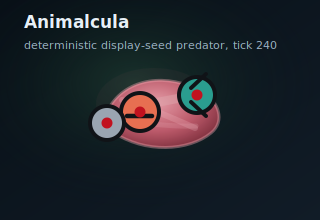

# Animalcula



Animalcula is a 2D artificial life simulator about evolving, physics-based microscopic creatures. The project is building toward a long-running browser display where lineages diversify, compete, feed, reproduce, and slowly reshape an ecosystem over time.

## What It Is

Each creature is a small articulated body with an evolvable CTRNN brain. Bodies can include mouths, grippers, sensors, and photoreceptors; the world provides nutrient, light, chemical, and detritus fields; and selection happens through energy gain, movement, predation, reproduction, and death instead of scripted behavior.

## What Works Today

- deterministic seeded runs with checkpoints, resumes, JSONL logs, SQLite logs, sweeps, and seed-bank promotion workflows
- evolving morphology and brains, including structural mutation, node-role mutation, motor-topology mutation, hidden-neuron growth, and lineage coloring
- a real ecology loop with photosynthesis, feeding, detritus scavenging, gripper-assisted predation, reproduction, speciation/extinction tracking, and environmental variation
- live inspection paths through `animalcula view` and the new browser-first `animalcula web`

## Viewer Paths

- `animalcula web` is the main frontend path: live FastAPI/WebSocket browser viewer with transport controls, inspection, and timeline scaffolding
- `animalcula view --viewer-backend tk` is a local live fallback/debug viewer
- `animalcula view --viewer-backend html` is a prerecorded HTML fallback for machines without Tk

## Current Focus

- deepen the browser frontend into the real long-running display UI
- keep tuning for stable, visually legible multi-niche ecologies
- preserve a clean seam between Python orchestration and the eventual Rust core

## Quickstart

Install and validate:

```bash
uv sync --group dev
uv run pytest
```

Run a short headless simulation:

```bash
uv run animalcula run --config config/default.yaml --ticks 10 --seed 42
uv run animalcula run --config config/default.yaml --ticks 10 --seed 42 --seed-demo
```

Open the live browser viewer:

```bash
uv run animalcula web --config config/display.yaml --seed 42 --seed-demo
```

Open a local viewer fallback:

```bash
uv run animalcula view --config config/display.yaml --seed 42 --seed-demo --viewer-backend tk --warmup-ticks 0
uv run animalcula view --config config/default.yaml --seed 42 --seed-demo --viewer-backend html --html-out /tmp/animalcula_view.html --max-frames 600
```

Headless analysis and tuning:

```bash
uv run animalcula report checkpoints/demo.json
uv run animalcula phylogeny checkpoints/demo.json --format newick
uv run animalcula sweep --config config/default.yaml --sweep sweep.yaml --ticks 100 --seed 42 --seed-demo --workers 4 --out results.jsonl
uv run python scripts/tune_phase1.py --ticks 1000 --seeds 41,42,43 --workers 4 --turbo --out /tmp/animalcula_phase1.jsonl
```

When `animalcula view` has to build the HTML fallback, TTY terminals show two phases: `warming viewer` and `recording html viewer`.

## Project Docs

- `ANIMALCULA_SPEC.md`: design source of truth
- `AGENTS.md`: project context and working rules
- `CONTRIBUTING.md`: workflow and commit conventions
- `CHANGELOG.md`: notable changes
- `docs/tuning/phase1.md`: current tuning workflow and findings

## Next Build Step

Build upward from the headless nursery/recycling/turbo/genome loop into fuller evolution and analytics while now treating the browser frontend as the main viewer path: deepen the live WebSocket/browser inspector, timeline, and lineage panels, validate the new nutrient-epoch/light/drag variation plus dominance-triggered perturbations across longer multi-seed runs, use the new peak-share and runaway-dominance metrics to separate healthy turnover from monoculture lock-in, study promotion manifests for genome-hash carryover and diversity drift across rounds, and keep tuning predator consistency now that capture-assisted predation can bootstrap and brain capacity can widen.
